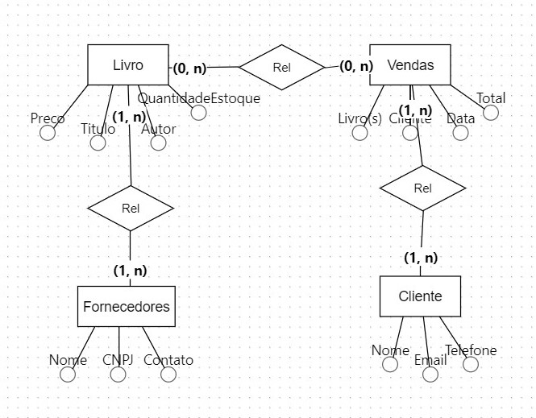
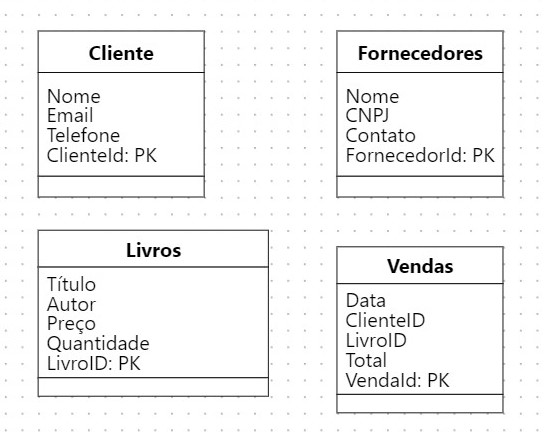

# Books-Co
Um pequeno projeto de Banco de Dados para uma bookstore.
- Projetar e implementar um pequeno banco de dados relacional que suporte as operações básicas de um sistema de gerenciamento de livraria.

# Modelagem Conceitual: 

# Modelagem Lógica: 

# Modelagem Relacional: 

